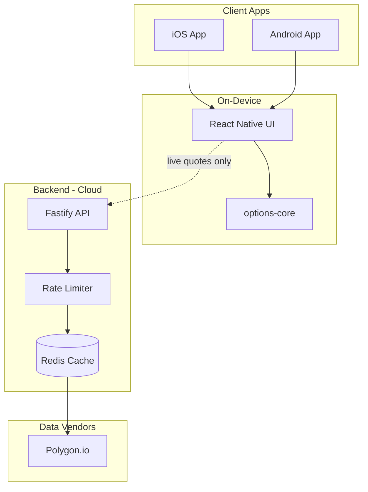

# Architecture: AI Options Calculator App

## Executive summary

This document describes how [projectoption.com](https://projectoption.com) works, how we replicate it, and how to scale to hundreds of thousands of users.

---

## 1. projectoption.com analysis

### 1.1 Free calculators (what we're replicating first)

**URL:** https://projectoption.com/calculators

All 20 calculators are static Astro pages with client-side React hydration. Key findings from bundle analysis:

| Module | Purpose |
|--------|---------|
| `greeks.CWpYop_s.js` | Black-Scholes call/put pricing, Greeks (delta, gamma, theta, vega, rho) |
| `implied-volatility.Db9Kq2hL.js` | Bisection-based IV solver |
| `chart-drawing.sKWiOuRJ.js` | P/L curve rendering on canvas |
| `call-option-calculator.*.js` | Per-strategy UI + parameter defaults |

**No network calls** are made during calculation. Users enter:
- Stock price, strike(s), DTE
- IV (or option price for reverse calculation)
- Risk-free rate, dividend yield, quantity

### 1.2 Premium features (future phase)

| Feature | Data requirement |
|---------|-----------------|
| Live options chain | Real-time options quotes from vendor |
| Option Modeler | Chain + portfolio state + P/L curves |
| IV Screener | Historical IV + HV for 300+ tickers |
| T+ time modeling | Theoretical pricing at future dates |
| IV shift modeling | Re-price with adjusted vol surface |

### 1.3 projectoption market data stack (reverse-engineered)

```
Browser/App
    │
    ├─▶ Supabase (auth, profiles, saved portfolios)
    │
    └─▶ api.projectoption.com
            │
            └─▶ Market data vendor (likely Polygon.io)
```

Evidence:
- `auth.BY4AHFQy.js` routes API calls to `api.projectoption.com`
- Supabase client for PKCE auth flow
- `/api/v2/telemetry/auth-debug` endpoint for observability
- 4,000+ ticker coverage matches Polygon's US options universe

---

## 2. Our system architecture

### 2.1 Design principles

1. **Compute at the edge (device)** — All calculator math runs on-device. This is how projectoption's free tools work and it scales infinitely.
2. **Proxy market data** — Never embed vendor API keys in mobile apps. All live data goes through our API.
3. **Aggressive caching** — Options chains change slowly intraday. 60-second cache reduces vendor costs 100x+.
4. **Shared core library** — One TypeScript package used by mobile, API, and future web.

### 2.2 Component diagram



### 2.3 Data flow: calculator (offline)

```
User inputs → options-core strategy function → P/L curve + metrics → SVG chart
```

Latency: <5ms. No network. Works in airplane mode.

### 2.4 Data flow: live chain (online)

```
App → GET /api/v1/options/AAPL/chain
  → Redis hit? Return cached (60s TTL)
  → Redis miss? Fetch Polygon → normalize → cache → return
```

---

## 3. Scaling to 100k+ users

### 3.1 Load estimates

| Scenario | Users | Calc ops/sec | API calls/sec |
|----------|-------|-------------|---------------|
| Free calculators only | 100k | 0 (on-device) | 0 |
| 10% use live chains | 100k | 0 | ~500-2000 |
| Active trading hours | 100k | 0 | ~5000 peak |

With 60s chain cache and ~500 popular tickers, max vendor calls ≈ **8 req/sec** regardless of user count.

### 3.3 Infrastructure recommendations

| Component | Service | Config |
|-----------|---------|--------|
| API | Cloud Run / ECS Fargate | 2-10 instances, auto-scale on CPU |
| Cache | Redis (Upstash / ElastiCache) | 256MB sufficient |
| CDN | Cloudflare | Cache search results |
| Mobile | EAS Build + OTA updates | Expo for rapid iteration |
| Monitoring | Datadog / Grafana | API latency, cache hit rate |

### 3.4 Cost model (rough)

| Item | Monthly cost at 100k users |
|------|---------------------------|
| Polygon Options plan | $200-500 |
| Redis (Upstash) | $10-50 |
| Cloud Run (2 instances) | $50-150 |
| **Total** | **~$300-700/mo** |

Compare to serving uncached: 100k users × 10 chain views/day × $0.001/call = **$30k/day**.

---

## 4. Market data provider comparison

| Provider | Options chains | Greeks | Real-time | Pricing |
|----------|---------------|--------|-----------|---------|
| **Polygon.io** | ✅ Excellent | ✅ Included | ✅ WebSocket | $200+/mo |
| **Tradier** | ✅ Good | ✅ Included | ✅ | Brokerage required |
| **Market Data API** | ✅ Good | ✅ | ✅ | $30+/mo |
| **CBOE LiveVol** | ✅ Professional | ✅ | ✅ | Enterprise |
| **Yahoo Finance** | ⚠️ Unofficial | ❌ | ⚠️ | Free (unreliable) |

**Recommendation:** Polygon.io for production. Mock provider for development.

---

## 5. Mobile app architecture

### 5.1 Tech stack

- **Expo SDK 53** with React Native 0.79
- **Expo Router** for file-based navigation
- **react-native-svg** for P/L charts
- **@ai-options/core** for all calculations

### 5.2 Why Expo over native Swift/Kotlin

| Factor | Expo | Native |
|--------|------|--------|
| Time to market | 1 codebase | 2 codebases |
| Performance for calculators | Excellent (math is native JS) | Marginal gain |
| Chart rendering | SVG (fast enough) | Slightly faster |
| Team size needed | 1-2 devs | 3-4 devs |

For calculator-heavy apps, shared TypeScript core matters more than native UI.

### 5.3 Performance optimizations

- Calculations memoized with `useMemo`
- P/L curves computed once per "Calculate" tap
- Charts use lightweight SVG paths (not WebView)
- New Architecture enabled (`newArchEnabled: true`)

---

## 6. Implementation phases

### Phase 1 — Complete ✅
- [x] Shared options-core library with tests
- [x] All 20 calculators
- [x] Expo mobile app with navigation
- [x] Market data API scaffold

### Phase 2 — Live data integration
- [ ] Pre-fill stock price from API in calculators
- [ ] Options chain browser screen
- [ ] Pull-to-refresh quotes

### Phase 3 — Premium features
- [ ] Multi-leg portfolio builder
- [ ] T+ time modeling
- [ ] IV screener with pre-computed metrics
- [ ] User accounts + saved portfolios

### Phase 4 — Production hardening
- [ ] Auth (Supabase/Firebase)
- [ ] App Store / Play Store submission
- [ ] Load testing (k6)
- [ ] Observability (OpenTelemetry)

---

## 7. Security considerations

- API keys stored in server environment only
- Rate limiting prevents abuse
- No PII in calculator flows (offline-first)
- HTTPS everywhere
- Certificate pinning for production mobile builds
