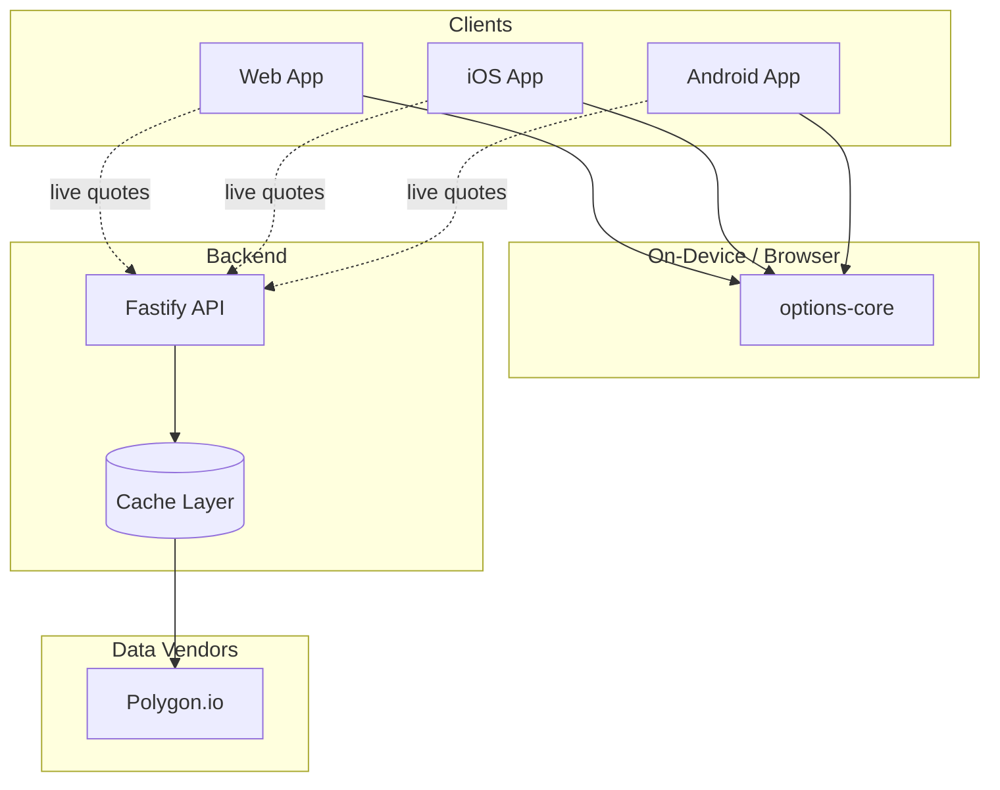

# Architecture: AI Options

## Overview

AI Options is a cross-platform options calculator suite with a shared math engine, web preview, native mobile apps, and a scalable market-data API.

---

## System design

### Core principles

1. **Compute at the edge** — All calculator math runs on-device or in the browser. No server round-trips for P/L curves.
2. **Proxy market data** — Vendor API keys stay on the server. Mobile and web clients call our API only.
3. **Aggressive caching** — Options chains are cached (60s TTL) to minimize vendor costs at scale.
4. **Shared library** — One TypeScript package (`options-core`) powers web, mobile, and API.

### Component diagram



---

## Calculators

All 20 calculators use Black-Scholes-Merton pricing with user-supplied inputs:

- Stock price, strike(s), days to expiration
- Implied volatility (or option price for reverse IV)
- Risk-free rate, dividend yield, contract quantity

Outputs: P/L curve, max profit/loss, breakevens, and Greeks where applicable.

---

## Market data

### Calculator mode (offline)

No network required. Users enter parameters manually. Latency is under 5ms.

### Live data mode (online)

```
Client → GET /api/v1/options/:symbol/chain
  → Cache hit? Return cached response
  → Cache miss? Fetch from Polygon → normalize → cache → return
```

| Endpoint | Cache TTL |
|----------|-----------|
| `GET /api/v1/quote/:symbol` | 15 seconds |
| `GET /api/v1/options/:symbol/chain` | 60 seconds |
| `GET /api/v1/search?q=` | 5 minutes |

---

## Scaling

### Load profile at 100k users

| Scenario | Server load |
|----------|-------------|
| Calculator-only usage | Zero (all on-device) |
| 10% using live chains | ~500–2000 API req/sec peak |
| With 60s chain cache | ~8 vendor req/sec regardless of users |

### Infrastructure

| Component | Recommendation |
|-----------|----------------|
| API | Cloud Run / ECS Fargate, auto-scale |
| Cache | Redis (Upstash / ElastiCache) |
| Web | GitHub Pages (static) |
| Mobile | EAS Build + OTA updates |

### Estimated monthly cost at 100k users

| Item | Cost |
|------|------|
| Polygon Options plan | $200–500 |
| Redis | $10–50 |
| API hosting | $50–150 |
| GitHub Pages | Free |
| **Total** | **~$300–700/mo** |

---

## Design system

| Token | Value |
|-------|-------|
| Background | `#0a0a0f` |
| Surface | `rgba(255,255,255,0.03)` |
| Primary | `#55CFFF` |
| Text | `#ffffff` |
| Muted | `#94a3b8` |
| Profit | `#22c55e` |
| Loss | `#ef4444` |

Typography: Inter. Dark theme with cyan accents and subtle glass-morphism cards.

---

## Implementation phases

### Phase 1 — Complete
- [x] Shared options-core library with tests
- [x] All 20 calculators
- [x] Web app with GitHub Pages deployment
- [x] Expo mobile app
- [x] Market data API scaffold

### Phase 2 — Live data
- [ ] Pre-fill stock price and IV from API
- [ ] Options chain browser
- [ ] Pull-to-refresh quotes

### Phase 3 — Advanced features
- [ ] Multi-leg portfolio builder
- [ ] T+ time modeling
- [ ] IV screener
- [ ] Saved portfolios with auth

### Phase 4 — Production
- [ ] App Store / Play Store submission
- [ ] Load testing
- [ ] Observability

---

## Security

- API keys stored server-side only
- Rate limiting on all public endpoints
- HTTPS everywhere
- No PII required for calculator usage
